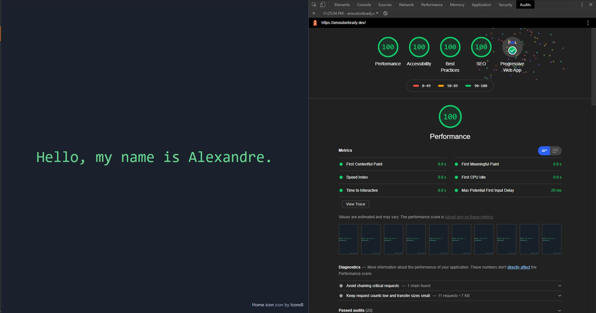

# Blog generator based on static file

Minimal, experimental & opinionated static blog generator



## Installation

```bash
git clone https://github.com/amoutonbrady/sbg
yarn
```

## Building

### Build command

`yarn build`

### Build process

The build will automatically create a dist folder with everything routed for a static host.

Additionnally, it will also provide a service worker to make the website work offline and please the search engine with an **okay-ish** Lighthouse score.

## Architecture

```
├───assets
├───layouts
├───pages
└───posts
```

-   `assets`: contains all the images (we don't care about CSS or JS)
-   `layouts`: contains the layouts, see the different layouts below
-   `pages`: each html file will represent a page (eg: blog.html will turn into /blog/index.html). The `posts` param will be auto-injected
-   `posts`: contains your posts content. The title of the file will be the slug

## Layouts

All layout file have to be in the `layouts` folder.

Layouts are just [nunjucks](https://mozilla.github.io/) templates.

Any data defined in the [front matter](https://jekyllrb.com/docs/front-matter/) markdown files will be injected in the corresponding layout. First it will be be parsed by [gray-matter](https://github.com/jonschlinkert/gray-matter), then compiled to html via [marked](https://marked.js.org/). All code will be automatically highlighted by [shiki](https://github.com/octref/shiki).

The `content` variable is the compiled markdown.

List of supported template files:

-   `post.html`

More to come as the project needs it.

## Config

If a `config.js` is at the root of the directory, it will be resolved and used.

Its needs to default export a configuration object.

For the moment only the `filters` key work. It is an array of filters for njk templates.

## Technical details

You can see this project as a very tiny little micro compiler that just scan templates, scan content files and match inject the right content in the right template. Everything happens in the `main.js` and is okayishly commented.

## TODO

### Initial TODOS

-   [x] ~~Moare layouts (specifically index with list of posts)~~ Implemented as "pages"
-   [x] ~~Process assets~~ Only for JS (minification) & CSS (dead code removal, minification, autoprefixer, tailwind)
-   [ ] ~~Mess around with typescript maybe~~ Delayed for later
-   [x] ~~Make it agnostic and configurable maybe~~ Sort of implemented it (only njk filters for now)
-   [x] ~~Add feedback on the CLI~~ Added some more context during build
-   [x] ~~Add a develop mode maybe~~ Add a "serve" command to serve the dist, still to build manually for now

### 02/25/2020

-   [ ] Inject a `pages` variable in the pages files to be able to make a navigation
-   [ ] Add a filter or something to make some sort of pagination
-   [ ] Fix perfs issues if possible...
-   [ ] Mess around with typescript maybe, could be useful for the config
